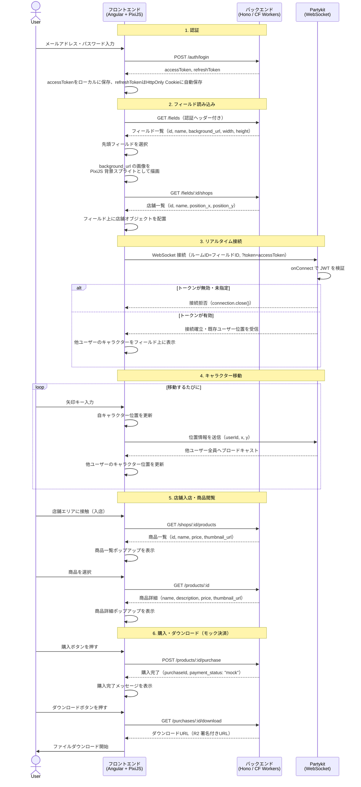

# システムフロー図

フロントエンド・バックエンド・Partykit 間の処理フローをまとめたドキュメント。

> LiveKit（通話）・決済サービスは後から追記予定。

---

## 全体フロー

---

## 補足

| フロー                | 備考                                                                                                                                                                                                                                                                                                                                                                                   |
| --------------------- | -------------------------------------------------------------------------------------------------------------------------------------------------------------------------------------------------------------------------------------------------------------------------------------------------------------------------------------------------------------------------------------- |
| 認証                  | `accessToken` の有効期限が切れた場合、`POST /auth/refresh` で再発行する（フロー省略）                                                                                                                                                                                                                                                                                                  |
| フィールド読み込み    | 現時点では `/fields` の先頭1件を固定で使用。将来的にはロビー画面でユーザーが選択                                                                                                                                                                                                                                                                                                       |
| Partykit 認証         | フロントエンドは WebSocket 接続時に `?token=accessToken` を付与。Partykit の `onConnect` で JWT を検証し、無効なら接続を拒否する。BE と Partykit で同じ `JWT_SECRET` を共有することで Partykit 単独で検証可能                                                                                                                                                                          |
| Partykit 認証（発展） | 現在は対称鍵（`HS256`）のため BE と Partykit で同じ `JWT_SECRET` を共有する必要がある。非対称鍵（`RS256` / `ES256`）に切り替えると、BE が秘密鍵で署名し Partykit は公開鍵で検証するだけになるため、秘密鍵を外部に渡す必要がなくなりセキュリティが向上する（デメリット：鍵ペアの生成・管理が少し複雑になる）。ハッカソンスコープでは `HS256` で十分だが、将来的な改善候補として検討する |
| Partykit ルーム       | フィールドIDをルームIDとして使うことで、将来複数フィールドに対応できる                                                                                                                                                                                                                                                                                                                 |
| 背景画像              | 現在はローカルの仮パス。R2 整備後は `background_url` を R2 URL に差し替えるだけでOK                                                                                                                                                                                                                                                                                                    |
| 決済                  | 現在はモック（購入ボタン押下で即完了）。Stripe 等への差し替えは `POST /products/:id/purchase` 内部の実装変更のみで対応予定                                                                                                                                                                                                                                                             |
